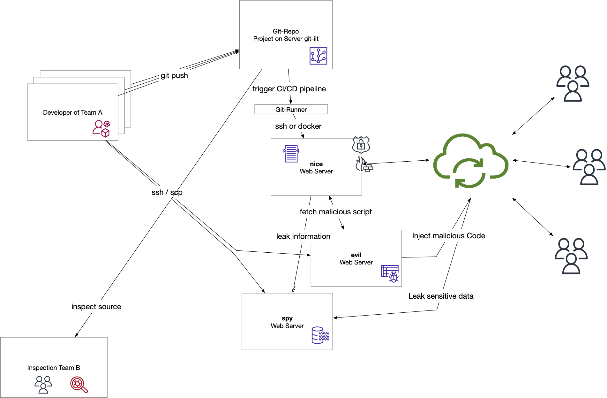
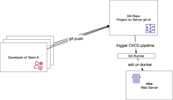
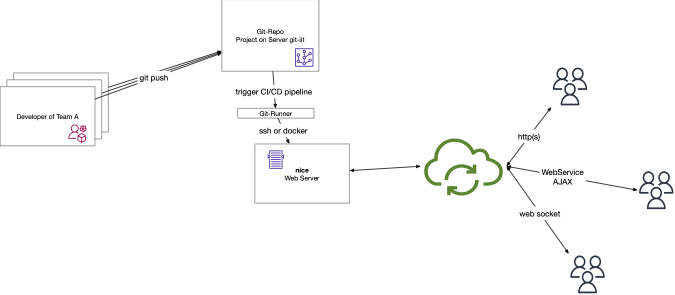
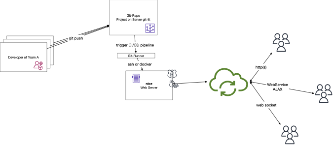
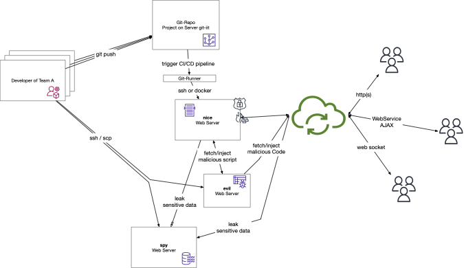
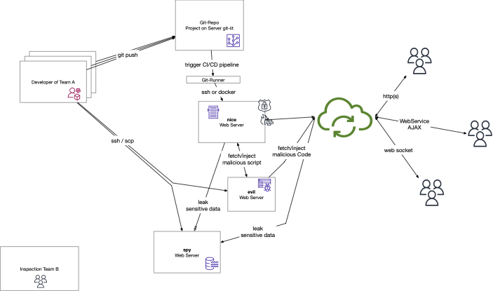
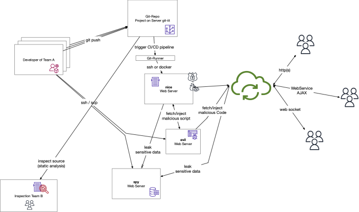
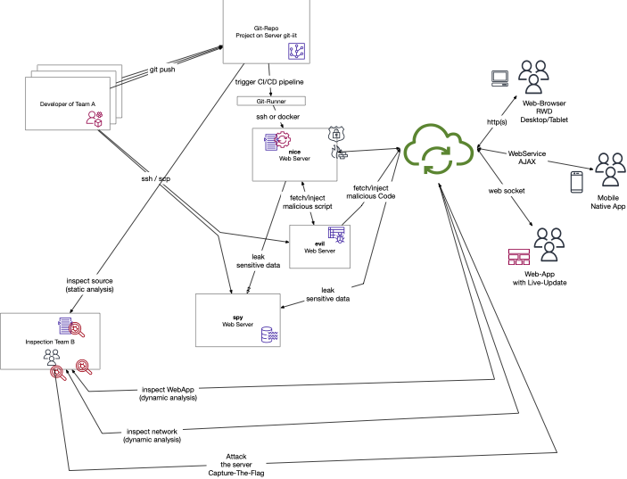

# Battle

### Idea 

A Web Security **Battle between two Teams** of 2 Students each. Teams of three is allowed only, if otherwise someone would have to work alone. 

* Team A: Create a server which pretends to fulfil a simple, straitforward task. Add hidden, unexpected features [^internalnote] which allow to break into the server and which allow to steal information from users. Document for tutors what you have 

* Team B: First, try to find out what the WebApp pretends to do. Then, find out what the WebApp really does. Finally, break into WebApplication and create a working hack. You are allowed to see the full source code of the WebApp created by Team A. 

### Overview Architecture and Flow

The overall system architecture including the nice+evil+spy server.

[](./figures/SecWeb-DevOps-A-Visual-Guide.pdf)


### Step-by-Step

* **Step 1** Team A

	[](./figures/SecWeb-DevOps-A-Visual-Guide-Step-1-Team-A.pdf)
	
* **Step 2** by Team A: develops a web applications and deploys the application on a server

[](./figures/SecWeb-DevOps-A-Visual-Guide-Step-2-Team-A-Devel+Serve-WebApp.pdf)
	
	
* **Step 3** Users can access on the server the progressive (single-page, responsive) web application, the ReSTful web service api, and the web socket connection for real-time apps providing server push.  

	[](./figures/SecWeb-DevOps-A-Visual-Guide-Step-3-Users-of-the-WebApp.pdf)


* **Step 4** by Team A: The team secures the server.

	[](./figures/SecWeb-DevOps-A-Visual-Guide-Step-4-Team-A-Secure-The-Server.pdf)


* **Step 5** by Team A: Hidden features are added which allow to steal sensitive user data and send the information to a spy server. Furthermore malicous code can be retrieved from server evil to be injected into the running web app.

	[](./figures/SecWeb-DevOps-A-Visual-Guide-Step-5-Team-A-Add-Hidden-Features+Evil+Spy-Servers.pdf)


* **Step 6** Team B

	[](./figures/SecWeb-DevOps-A-Visual-Guide-Step-6-Team-B.pdf)


* **Step 7** by Team B: For inspecting the code, the team clones the public available code from the repository and performs static analysis. 

	[](./figures/SecWeb-DevOps-A-Visual-Guide-Step-7-Team-B-Static-Analysis-Inspect-Code.pdf)


* **Step 8** by Team B: Dynamic analysis is performed. The Web App is used and evaluated by the theam and the network traffic gets intercepted. 

	[](./figures/SecWeb-DevOps-A-Visual-Guide-Step-8-Team-B-Dynamic-Analysis-Inspect-App+Network.pdf)


* **Step 9** by Team B: Multiple attacks are run against the web server to capture the flag. 

	[](./figures/SecWeb-DevOps-A-Visual-Guide-Step-9-Team-B-Attack-and-CaptureTheFlag.pdf)


### Requirements

Use **FH VPN**!


* We assume following IPs for the servers:
	* e.g. for team C  <= find out the ips for your team at Moodle (e.g. download file 'ArchiveTeamC.zip')
	* 10.77.23.80 spy  
	* 10.77.23.166 evil 
	* 10.77.23.62 nice 


### Setup/Instructions

How to setup three servers on the OpenStack infrastructure.

* Configure my notebook (for ssh and git)
	* create / update /check global `gitconfig` for username / email
		* `git config --global --list` 
	* create ssh-key pair to use with git-iit 
		* e.g. create key of type *rsa* with length of *2048* bits:  `ssh-keygen -C "<me>@<mynotebook>" -f ~/.ssh/id_ed25519_git-iit` 
		* e.g. `~/.ssh/id_ed25519_git-iit` and `~/.ssh/id_ed25519_git-iit.pub` 
		
		* Possibly, you want to add configuration to your `~/.ssh/config`. 
	
			```yaml 
			Host git-iit.fh-joanneum.at
			    HostName git-iit.fh-joanneum.at
			    IdentityFile ~/.ssh/id_ed25519_git-iit
			    User git
			    IdentitiesOnly yes
			```
	
	
	* get ssh keypair for accessing given Linux servers on OpenStack 
		* e.g. `~/.ssh/id_ed25519_Team-C` and `~/.ssh/id_ed25519_Team-C.pub`
		* *Note: make sure only the user can access the private key (i.g. the permissions for the private key have to be set using `chmod 600 ~/.ssh/id_ed25519_Team-C`)*
	* configure your `~/.ssh/config`
		* e.g. for Team C with ip of *nice* server `10.77.23.62`:

		```yaml
		Host SecWeb-Team-C-Evil 10.77.23.166
		  Hostname 10.77.23.166
		Host SecWeb-Team-C-Spy 10.77.23.80
		  Hostname 10.77.23.80
		Host SecWeb-Team-C-Nice 10.77.23.62
		  Hostname 10.77.23.62
		
		Host SecWeb-Team-C-Evil SecWeb-Team-C-Spy SecWeb-Team-C-Nice
		   Port 22
		   User debian
		   RemoteForward 52698 localhost:52698
		   IdentityFile  ~/.ssh/id_ed25519_Team-C
		   IdentitiesOnly yes
		```
		 
	* test connections (and check added server to `known_hosts` file)

		```bash
		ssh debian@10.77.23.80 -i ~/.ssh/id_ed25519_Team-C
		
		# Optionally:
		cat ~/.ssh/known_hosts
		```
	
	* 	Optionally, add the server of interest (names with IP) to `/etc/hosts/`:

		```
		10.77.23.62 nice
		10.77.23.166 evil
		10.77.23.80 spy
		
		# try with ping, and/or curl
		ping -c 1 nice
		```
	
* Setup Gitlab (git-iit) project 
	* Copy keys to gitlab server via web interface
		* At *preferences* / *ssh keys* (<https://git-iit.fh-joanneum.at/-/profile/keys>) paste the text (the public key) into the field and add the key. 
	* Try to access the server ` ...`
		* add git-iit.fh-joanneum.at to file `known_hosts`:

			```bash
			ssh git-iit.fh-joanneum.at
			
			# for troubleshooting use verbose mode
			ssh -vvv git-iit.fh-joanneum.at
			```
				
		* check: 

			```bash
			cat known_hosts |grep 91.229.57.117
			# git-iit.fh-joanneum.at,91.229.57.117 ecdsa-sha2-nistp256 AAAAE2VjZHNhL...YB4gtCcSVX0ujINi4=
			``` 

		
	* On Windows you want to make sure that the Powershell uses the proper ssh exe, so you might need to set environment variable `SSH_GIT` to the path of the ssh exe, such as `C:\Windows\System32\OpenSSH\ssh.exe`. 
	* Try to clone your project `git clone ... `


* Configure Linux Server **evil** on OpenStack

	```bash
	ssh evil
	cd evil-server-for-team-C-port-7003
	mkdir -p serve-this-static-data
	echo "alert('be aware');" > serve-this-static-data/index.js
	echo '<html><script src="index.js"></script></html>' > serve-this-static-data/index.html
	python3 -m http.server 7003 -d serve-this-static-data
	```
	
	* Open another terminal and test on localhost (with web browser <http://evil:7003> or, which is much better) with `curl`:
	
		```bash
		curl evil:7003/index.js
		curl evil:7003/index.html
		``` 
	
* Configure Linux Server **spy** on OpenStack

	```bash
	ssh spy
	cd spy-server-for-team-C-port-9003
	mkdir -p dynamic-server-to-log-data
	cat <<-EOF > dynamic-server-to-log-data/server.js
		#!/usr/bin/env node
		var http = require('http');
		const fs = require('fs');
		const ef = (err) => {if (err) {console.log(err);};};
		callback = function (req, res) {
		fs.appendFile("spy.log", new Date() + ": url=" + req.url+" method=" + req.method+ "headers=" + req.rawHeaders,ef);
		  if (req.method == 'POST') {
		    var body = '';
		    req.on('data', function (data) { body += data; });
		    req.on('end', function () { fs.appendFile("spy.log",body+"\n",ef); });
		  } else{ fs.appendFile("spy.log","\n",ef); } ;
		  res.writeHead(200, {'Content-Type': 'text/html'});
		  res.end('<html><head><title>Spy Server</title></head><body>we got headers: '+JSON.stringify(req.rawHeaders)+'</body></html>\n');
		}
		http.createServer(callback).listen(9000);
	EOF
	
	# permissions
	chmod +x dynamic-server-to-log-data/server.js 
	
	# startup 
	dynamic-server-to-log-data/server.js
	```

	* Open another terminal and test on localhost (with web browser <http://spy:9000/look/we/got?a=very&secure#pwd> or, which is much better) with `curl`:
		
		```bash
		curl 'http://spy:9003/look/we/got?a=very&secure#pwd' --cookie "api-key=c54f32b21; lang=en" --data "user=admin&pwd=verysecure"
		```

* Configure Linux Server **nice** on OpenStack
	* connnect 

		```bash
		ssh nice
		```
		
	* configure bash, such as 

		```bash
		echo 'alias ll="ls -al"' >> ~/.bashrc 
		source ~/.bashrc
		```

	* install required software and tools (whatever you need)

		```bash
		sudo apt-get update
		sudo apt-get install tree, npm
		tree .
		```
		
	* provide a server on your local machine (your notebook)
			
		* Find in [Part-08-MinimalServer](https://git-iit.fh-joanneum.at/omd/web-devel/-/tree/master/Part-08-MinimalServer/1-typescript-server) an example of TypeScript Server
			* Two-Step - Short Version:
			* (1/2) copy `setup.sh` and `templates` - folder from the repo into your project 
			* (2/2) startup `./setup.sh` which creates a `minimal` ts server.
				* Note: the setup script just copies some template files (`*.ts`, `*.json`) and installs the required packages using `npm install`. 

		* Create the server (then change into server base dir)
					
			```bash
			./setup.sh
			cd minimal

			# check the directories/files created 
			tree -I node_modules
			#		.
			#		├── README.md
			#		├── dist
			#		│   └── app
			#		│       ├── index.js
			#		│       └── tools
			#		│           └── helper.js
			#		├── package-lock.json
			#		├── package.json
			#		├── src
			#		│   └── app
			#		│       ├── index.ts
			#		│       └── tools
			#		│           └── helper.ts
			#		└── tsconfig.json
			```
	
		* Server in devel mode (i.e. auto)
	
			```bash
			npm run serve
			```

		* Build (into `dist`-folder) and startup the server

			```bash
			npm run build
			npm start
			``` 

		* Locally, test connection
			* curl: `curl localhost:8080`
			* web-browser: <http://localhost:8080/> 

* Copy local code to the server

	```bash
	ssh nice "mkdir -p ts-server-base"
	scp -r dist/* nice:ts-server-base/
	ssh nice "tree ts-server-base"
	```
* Startup the server (first change port from 8080 to 80)

	```bash
	ssh nice "cd ts-server-base/app && sudo node index.js"	```

	
* Test connection:
	* ssh nice "curl localhost"
	* curl: `curl -v nice` (or `curl 10.77.23.207.86`)
	* web-browser: <http://nice/> (or <http://10.77.23.207>) 


* Run your server as Linux daemon see 
	* Prepare a configuration file, e.g. `/home/debian/niceserver.service` (in any directory you like)

		```ini
		[Unit]
		Description=The Nice TypeScript Server
		After=network.target

		[Service]
		User=debian
		WorkingDirectory=/home/debian/ts-server-base/
		Environment=PORT=8080
		ExecStart=/usr/bin/node /home/debian/ts-server-base/app/
		Restart=always

		[Install]
		WantedBy=multi-user.target
		```

	* Link the file to be used by **systemd**

		```bash
		# better specify full path (e.g. `/home/debian/niceserver.service`) when linking:
		sudo ln -sf /home/debian/niceserver.service /etc/systemd/system/niceserver.service
		```
	* Reload the list of services 

		```bash
		sudo systemctl daemon-reload
		```

	* And start/stop/restart the service now

		```bash
		systemctl status niceserver
		sudo systemctl start niceserver
		sudo systemctl stop niceserver
		sudo systemctl restart niceserver
		systemctl status niceserver
		```

* Optionally, setup git pipline for CI/CD to server nice
	* e.g. simple ssh to server
		* See explanation in repo [Distributed Computing / setup gitlab pipeline](https://git-iit.fh-joanneum.at/omd/dist-comp/-/blob/master/setup-gitlab-pipeline/README-Gitlab-CI-pipeline.md)
		* Short - Version
			* create project, clone, put `nice-ts` TypeScript Server into the base dir 
			* `git add *`, `git status`,  `git commit -am "added ts server"`, `git push`
			* create file `.gitlab-ci.yml` (and add to git, commit, and push)

				```yaml
				before_script:
				   - 'which ssh-agent || ( apk update && apk add openssh )'
				   - eval $(ssh-agent -s)
				   - mkdir -p ~/.ssh
				   - chmod 700 ~/.ssh
				   - echo "$SSH_PRIVATE_KEY" | tr -d '\r' > ~/.ssh/id_ed25519_Team-C
				   - chmod 600 ~/.ssh/id_ed25519_Team-C
				   # For debugging, just call any Linux command to output info you need: 
				   #- ls -al ~/.ssh/
				
				
				stages:          # List of stages for jobs, and their order of execution
				#  - build       # TODO: Add build stage as dependency for test
				#  - test        # TODO: Add test stage as dependendy for deploy
				  - deploy
				         
				
				deploy-job:      
				  stage: deploy  # run in deply stage, i.e. when build and test was successful
				  image: alpine  # docker should run the git pipeline commands using image 'alpine'
				  tags:
				    - edu        # trigger the gitlab runner tagged with 'edu' 
				  script:
				    - echo "Deploying a file on a remote server. By ${CI_COMMIT_AUTHOR}..."
				    - echo "user=${SSH_USERNAME}, server=${SSH_SERVER}, port=${SSH_PORT}"
				    - echo "just for fun, we add a demo directory on the target server" 
				    - '/usr/bin/ssh -o UserKnownHostsFile=/dev/null -o StrictHostKeyChecking=no  -i ~/.ssh/id_rsa_nice ${SSH_USERNAME}@${SSH_SERVER} mkdir -p /home/debian/demo'
				    - echo "listing the current directory"
				    - pwd
				    - ls -al
				    - ls -al nice-ts
 				    - echo "TODO/Improve: compile/build step should happen on the runner" 
				    - '/usr/bin/scp -o UserKnownHostsFile=/dev/null -o StrictHostKeyChecking=no -P ${SSH_PORT} -i ~/.ssh/id_rsa_nice  nice-ts/dist/app/index.js ${SSH_USERNAME}@${SSH_SERVER}:/home/debian/ts-server-base/dist/app/index.js'
				    - '/usr/bin/ssh -o UserKnownHostsFile=/dev/null -o StrictHostKeyChecking=no  -i ~/.ssh/id_rsa_nice ${SSH_USERNAME}@${SSH_SERVER} sudo systemctl restart niceserver.service'
				    - echo "The server was successfully replaced and systemd service restarted."
				  only:          # trigger this job only if text "Deploy Nice Server" is part of your commit message 
				    variables:
				      - $CI_COMMIT_MESSAGE =~ /Deploy Nice Server/
				      
	  		
				```
			
			* on gitlab configure the variables **-/settings/ci_cd** Add variables
				* `SSH_SERVER 10.77.23.62` or whatever your nice server ip is
				* `SSH_PORT 22`
				* `SSH_USERNAME debian`
				* SSH_PRIVATE_KEY of your nice server (better: **protect variable**)
					* Hint: ` cat ~/.ssh/id_ed25519_Team-C` to reveal the text
			
			* make changes and deploy with commit message  *Deploy Nice Server*, e.g.: `git commit -am "Deploy Nice Server"`.

			* Checkout *-/pipelines* online 

			
	* Alternative: e.g. create **docker image** to run on server
	
		* Note 1: For your gitlab pipeline you have to use a Runner which supports **docker-in-docker** (e.g. at git-iit: use of `tags: dind`).
		* Note 2: To use the **container registry**, you have to activate it in the settings first (Per default, the container registry is deactivated). 
			* Check out: 
				
				```
				Settings 
					→ Gerneral 
						→ Visibility, project features, permissions 
							→ Container registry
				```
				
		* Example (parts of) gitlab pipeline using docker in docker for `docker build` and pushing to the container registry:
				
		```yaml
		image: docker:23.0.1
		
		variables:
		  DOCKER_TLS_CERTDIR: "/certs"
		
		services:
		  - docker:23.0.1-dind
		
		image-build:
		  stage: build
		  tags:
		    - dind
		  script:
		    - echo $CI_REGISTRY_PASSWORD | docker login -u $CI_REGISTRY_USER --password-stdin $CI_REGISTRY
		    - docker build -t $CI_REGISTRY_IMAGE:latest .
		    - docker image push --all-tags $CI_REGISTRY_IMAGE
		    - docker logout $CI_REGISTRY
    ... 
		```
		
		The `$CI_REGISTRY_PASSWORD`, `$CI_REGISTRY_USER`, `$CI_REGISTRY`, and so on are [predefined variables](https://docs.gitlab.com/ee/ci/variables/predefined_variables.html) in GitLab.
	
- - -

Links: Find this README.md at <https://git-iit.fh-joanneum.at/omd/web-devel/-/tree/master/Battle>


[^internalnote]: The hidden vulnerabilities and info-leaking features (incuding a working exploit) are made available to the tutor in separate documentation.