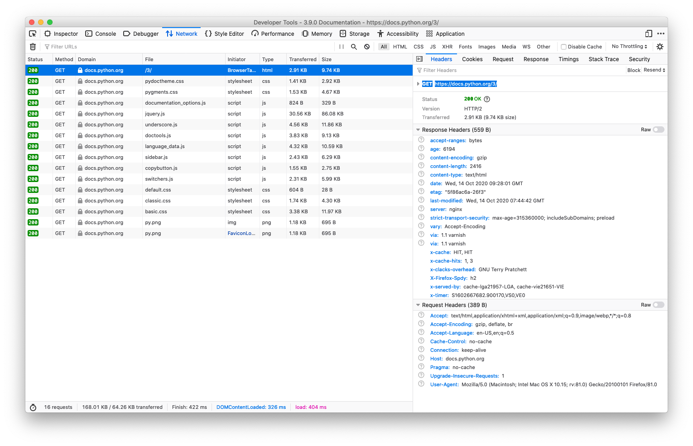
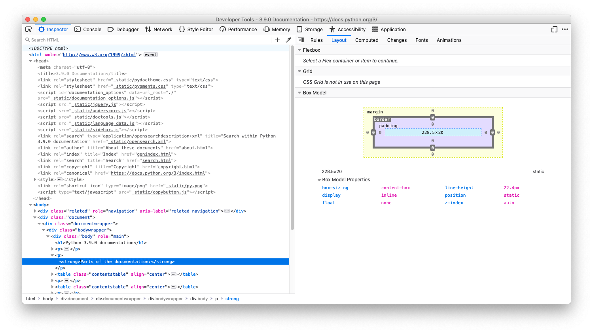

[Home](../README.md)


# What happens when you load a single web page 

For Windows we suggest the [git bash](https://gitforwindows.org).


### Step-by-Step

* (1) enter **URL** (in browser) ```https://docs.python.org/3/index.html``` 
	* 	*Note: internally, the default port 443 is added ```https://docs.python.org:443/3/index.html```*

* (2) resolve IP address of the server ```docs.python.org``` (via **DNS** system) ```199.232.16.223```

* (3) send the request from the browser on your local computer to  server `199.232.16.223`
	* The **HTTP request** uses the HTTP method **GET** to ask for a **resource** such as ```/3/index.html```. A HTTP GET request looks like

		```
		GET /3/index.html HTTP/2
		Host: docs.python.org
		User-Agent: Mozilla/5.0 (...
		...
		Accept: */*
		```
			
* We assume a computer on the Internet (here `199.232.16.223`) can be reached. This computer (= the server) has server software running. 
	* For example, the server requires:
		* a software called *nginx* (or any other **web server** software such as *Apache*, *Node*, or *IIS*),
		* which is listening on a **port** (here port number ```443``` for a secure connection)

* (4) the serverlogic finds or creates **resources** (to send the resources back to the client in step 5)
	* e.g. reads from internal file system
		* ```/some/directory/on/the/server/3/index.html```  
	* possibly, **creates cookie** string(s) and remember the cookie (store cookie internally, maybe in a database)

* (5) the response is created on the server. First, the first part of the response is created by calculating meta information, the *head*. Then, the data (e.g. image, text, zip, pdf) gets encoded (e.g. UTF-8, binary) into the *body* section of the response. Finally, the response is sent back to the client (to the browser on your machine).
	
	*  **head** (metadata including cookie string) with HTTP *status code* ok **200** and *content type* **text/html**
		
		```
		HTTP\2 200
		server: nginx
		content-type: text/html
		...
		Set-Cookie: language=en; expires=Sat, 17-Apr-2021 21:57:55 GMT; Max-Age=15768000
		...
		content-length: 9971
		``` 
	* **body** data (html text)

		```
		<!DOCTYPE html>
		<html lang="en>
		...
		...
		...
		</html>
		``` 
* (6) the client (your browser) receives the data
	
	* The browser inspect the **content-type** information provided in the *head* section of the response: 

		* If the data is some binary data (images, zip, pdf, Excel, ...) the browser decides what to do: (e.g. saving zipped data as file in the download directory, opening Excel data in MS Office, caching images used for rendering a web page)

		* If it is (textual) HTML data (often encoded in UTF-8) it can be analysed (see step 7 parsing)

* (7) the browser **parse**s text data  

	* create internal representation called Document Object Model (**DOM**) in memory

	* possibly, **save cookie(s)** (to the browser database)

	* extract (many) links. Links to further resources necessary, such as  CSS, images:
		* ``````   
		* ...
		* ```<link rel="stylesheet" href="_static/pygments.css" type="text/css" />```
		* ```<link rel="stylesheet" href="_static/pydoctheme.css" type="text/css" />```
		* ```<script src="_static/jquery.js"></script>```
		* ...
		* ```<script type="text/javascript" src="_static/switchers.js"></script>```

* (8a) **render** DOM, and at the same time:
 
* (8b) start (many) **background requests** for further data (the logo image, two CSS style sheets, many JavaScript "files"):
	* for each **background request** (some **in parallel**):
		* read cookie from browser database
		* **send request including cookie(s)**

			```
			GET /3/_static/jquery.js HTTP/2
			...
			Cookie: language=en;
			...
			```
			
	* when server answer arrives
	* parse answer
		* store data (css/imgases) internally (linked to DOM nodes)
		* render again to add an image or style
	* if resource is JavaScript
		* execute the JavaScript code
			* possibly modify DOM, then render again
			* possibly fetch further resources (text, images, styles) from server (see 8b)

*  (9) when user clicks a link
	* trigger (many) backgound requests (see 8b) to modify current page
	* or
	* load a fresh page (see 2,3,4,5..)


# Debugging #

### Browsers

* Install multiple browsers. At least Firefox and Chrome.
* Use *development tools*, activate *Develp Menu* (Safari) to show a **Web Inspector**.


* You must be able to find out:
	* how long it took to load a page (the first single HTML source code) and/or
	* how long it took to load an overall page (with JavaScript files, Images, etc.).

* You must be able to:
	* live-modify HTML and/or CSS,
	* inspect, find and delete cookies.

For example, inspect the (concurrent) network activities (downloaded documents). 


For example, as developer you might modify HTML and/or CSS on the fly.


### Command line Tools 

Recommendation: If you use Windows better install the [git bash](https://gitforwindows.org).

* Is server available? Try to ```ping``` the server.
	* For example, try three pings to docs.python.org server: ```ping -c 3 docs.python.org ```. 
* Load a single resource from a server with ```curl```[^curl].
	* Examples (use ```-v``` for *verbose*):
	* ```curl -v https://docs.python.org/3/index.html``` 
* Load a site (full home page) from a server with ```wget```[^wget].
	* Examples ```wget --recursive --timestamping --directory-prefix="tmp_down_dir" https://www.orf.at/``` 	

[^curl]: Just for your info: cURL stands for *Client URL*.
[^wget]: Just for your info: wget stands for *web get*.

## Web Development Toolchains

For performance reason, many web developers process their html, css and js files with multiple tools. 

The processing, the **optimising**, of html/css/js files includes:

* remove spaces
* combine files
* convert from other programming languages (e.g. Typescript) to others (e.g. JavaScript).

In such cases source-**map** files help during debugging, as they help developers to view not the converted, but the original files in the web inspectors.


## Performance Checks

How well does a webpage work? Inspect the criteria, which are relevant to users's browsing experience. For example, 

* Is it correct?
	* Are HTML and CSS structure, tags and attributes ok?
	* Will it render as expected on mobile devices?

* Is it fast?
	* How long does it take for the first full page rendered?
	* How much data has to be loaded (the amount of data might decrease the loading speed on low-bandwidth networks)?
	
* Use evaluation tools for your inspection:
	* W3C checker for HTML <http://validator.w3.org> and CSS <https://jigsaw.w3.org/css-validator/> 	
	* Google Pagespeed <https://developers.google.com/speed/pagespeed>
	* Metaforensic <https://www.metaforensics.io>


[Next part (HTML)](../Part-03-HTML/study-material--html.md)