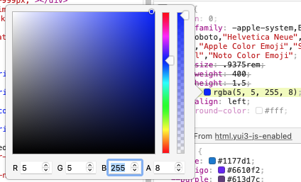
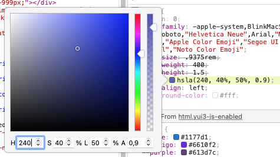

[Home](../README.md)

# Multimedia #

### Audio

* Formats
	* Codecs vs. Container
		* Codecs:
			* mp3 (wavelet), PCM, Vorbis, AAC, FLAC
		* Container
			* MP4
			* wave
			* WebM 
			* ogg 

### Video

To trick the human eye to **see motion**, a sequence of images is displayed fast enough. At least 20 to 30, so called **frames**, must should be displayed per second for smooth animations. This is specified in **fps**, frames per second. 


* lossy vs. lossless compression

* Formats
	* Codecs vs. Container
		* Codecs
			* H.264, VP8, VP9
		* Container
			* MPEG Video uses I, P and B frames.
			* ogg
 			* special formats:
			* e.g. HEVC (by Apple for improved compression over H.264)

			
### Images

* Attributes of an Image
	* Width, Height, Color depth, Color space 

* Pixel 
	* Image Size
		* width and height in pixel (px)
	* Color Depth 
		* e.g. so called *true colour* has bit depth of 24 bits (8 bit red, 8 bit green, 8 bit blue) 
	* DPI dots-per-inch (inch = 2,54 cm)
		* screens: 72dpi: 72 pixel each 2,54 cm
		* printers: 360dpi
		* Pixel 5 OLED display: 432 dpi
 
* Colors / Color spaces
	* RGB vs. CMYK vs. HSL
		* RGB is used on computer screens: Red / Green / Blue
			* additive (0..255) red/green/blue 
			* e.g.in CSS:
				* '#D4002D' for R:212, G:0, B:45
				* 'green' for  0,255,0
				* 'white' or '#FFFFFF' for  255,255,255
				* optional, **include alpha channel in CSS3**: ```color: rgba(0,255,0,0.5)```
				* e.g. rgba(0, 0, 255, 0.8) to set *blue* in brower WebTools

				
				
		* CMYK for printing
			* subtractive (absorbing/filtering colours of the sunlight)
			* Cyan, magenta, yellow, key (black)
		* HSL 
			* Hue 0° — 360° (e.g. 0°=360°=red, 60°=yellow, 240°=blue)
			* Saturation 0% — 100%, 
			* Luminance 0% - 100%, and (optionally)
			* Alpha 0.0 — 1.0 (e.g. 0.0 = transparent, 1.0 = opaque)
			* (in German: *Farbton*, *Sättigung*, *Helligkeit/Luminanz*)
			* e.g. hsla(240, 100%, 100%, 0.9) to set *blue* in browser WebTools

			
			
			
	* transparency (alpha channel)


* (Lossless) compression
	* fax machine 
		* black and white (b&w) bitmap, 1 bit
			* ```1111100010100111...```	 
		* lossless compression
			* run length encoding (RLE), huffman coding: ```5W3B1W1B23W...```
	* gif lossless compression 
		* (just for info: idea 'words in dictionary', LZW = Lempel-Ziv-Welch)
	* jpg
		* 24 bit
		* lossless OR lossy (user can set *quality*)

* Format
	* Vector (lines, circles, boxes, polygon, bezier *path*es) 
		* (+) full quality when zooming
		* (+) logos, illustrations, drawings
		* svg **scalable vector graphics**
			* XML (can be modified/animated with JavaScript, DOM manipulation) 
 
			```xml
			<svg xmlns="http://www.w3.org/2000/svg" viewBox="0 0 283.4 57" width="283.4" height="57">
			  <style>
			    .st0{fill:#D4002D;} .st1{fill:#000000;}
			  </style>
			  <path class="st0" d="M76.4 49.1v-7.3h1.4v...
		  </svg>
			``` 
		* gif
			* 8 bit = 255 colours 
			* transparency (alpha channel)
			* optional, with animation
			* E.g. 1x1 px images for user tracking  

	* Raster (fixed width, height)
		* (+) smoother gradients, high number of colours 
		* raw for photographers 
			* (different formats for Canon, Nikon,..)
			* e.g. 32 bits (more colours)  
		* png **portable network graphic**
			* 24 bit RGB 
			* 3 colors each with 8 bit
			* (+) lossless
			* (+) high compression
			* (+) transparency (for one/multiple palette index)
			* 32 bit RGBa (RGB + Alpha channel) 
			* 3 colors each with 8 bit + 8 bit for alpha channel
			* (+) transparancy (with alpha channel)
		* jpg
			* 24 bit = 0xFFFFFF = 16777215 = 	16,7 mio Colours
			* lossy(!) compression
			* (-) no transparancy
		* special formats:
			* e.g. HEIF / HEIC (by MPEG for improved compression over jpeg, used in Apple systems)
			* e.g. webp (by Google, open) 
			* e.g. jpeg XR (by Microsoft, includes alpha channel for transparency)


### Browser

* Use a **favicon**, a logo/symbol to be used by your browser to enhance your list of  favorites. The icon is also shown in the tab bar for every web page.

	```html
	<link rel="icon" href="/favicon.ico" type="image/x-icon">
	```


[Next part (CSS)](../Part-05-CSS/study-material--css.md)