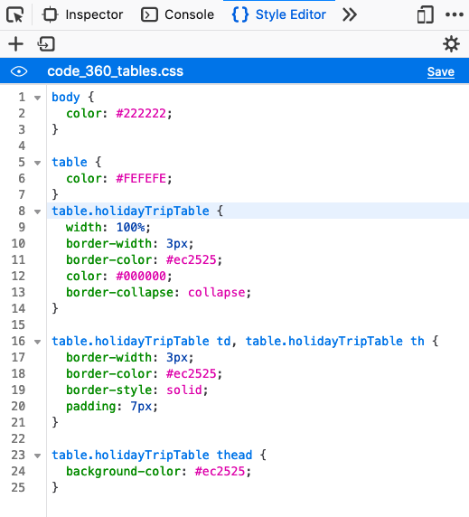
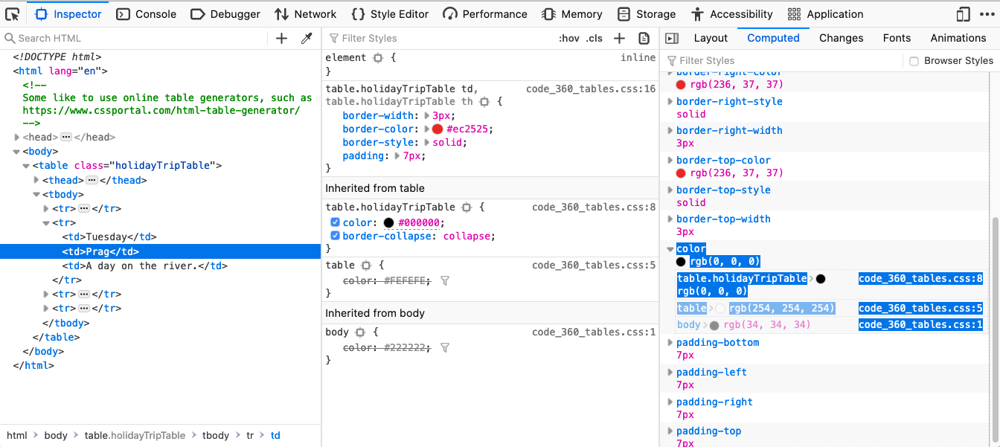
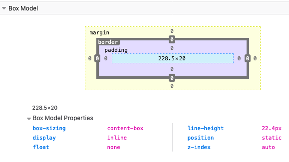

[Home](../README.md)

# CSS #

## The Idea of Layouts

Make your content fun and easy to understand. Create pages for human beings!

* Page looks *nice* (balanced, readable).
* Quickly know what it is all about!

## Implementation

First minimal example HTML + CSS 

* HTML file ```index.html```

	```html
	...
	<head>
   <link rel="stylesheet" href="fhjstyle.css">
	...
	```
	
* CSS file ```fhjstyle.css```

	```css
	body { color: green }
	```

*Note: Always use a [Validator](https://jigsaw.w3.org/css-validator/) to check if your styles are ok.*


## Using / Loading Stylsheets
* internal
* external
* conditional loading (e.g. depends on screen size)

 	
## Selectors

Find and apply a style to any DOM node. Find nodes:

* by tag: 
 	* in HTML: ```<main>```
	* in CSS: ```main{ background-color: #EEE; }``` 

* by (tag and) attribute: 
	* in HTML: ```<article study="ITM">```
	* in HTML: ```<section study="ITM">```
	* in HTML: ```<section study="SWD">```
	* in CSS: ```[study="ITM"]{ background-color: #EEE; }``` 
	* in CSS: ```article[study="ITM"]{ background-color: #EEE; }``` 


* by *a unique* **id** (e.g. such as ```mainArea ```): 
	* in HTML: ```<main id="mainArea">```
	* in CSS: ```#mainArea { background-color: #EEE; }``` 
	


* by class (the *class attribute*): 
	* in HTML: ```<main class="the_main_area">```
	* in CSS: ```.the_main_area { background-color: #EEE; }``` 

## Pseudo Selectors

Apply styles to elements, which might not be clear from the DOM tree. For example, apply different styles before and after a user has clicked on a link. Provide style for link ```a``` and one for link ```a:visited```. 

### Pseudo Classes 

A colon : preceding the selector.

* Examples for a link: ```<a ...```: ```<a:visited ...```, ```<a:hover ...```, ```<a:active ...```, ```<a:link ...```
* Examples for a text area: ```<textarea ...```: ```textarea:focus ...```, ```textarea:optional ...```
* Examples for logic: ```<div:not([disabled]) ...```, ```<p:empty ...``` 

### Pseudo Elements

Two colons :: preceding the element.

* Examples
	* ```::before```, ```::after```
	* ```::first-letter```
	 
### Combinators

* Combine multiple selectors
	* descendant = ...present/contained within element... 
		* space ``` ``` e.g. ```h3 div``` for a div as direct child of h3 tag.
		* star ```*``` e.g. ```h3 * div``` for a div as (grand)(grand)child of h3 tag.
	* child, (next/subsequent) sibling combinators
		* ```body > p```, ``body + p```, ```body ~ p```    
	* Combine multiple expressions:
		* Example: ```h5 ol>li em```
	 
### Details


* Which CSS rule will be applied, if more than one is given? 
	* **Declared rules** by **specificity** (determine which style to apply, id is more specific than classes than attributes than tags than general browser i.e. user agent settings) and *source order* (which file is loaded first)
	* **Inherited rules** by closest parent (Note the *cascade*: root, tag, child tag, grand-child tag, ...) 
	* In the Firefox/Chrome/Safari inspectors: The overridden rules are crossed out. The line numbers within the style files where the styles are defined are shown. The inheritance is visible (Note: inline styles first). The tab *Computed* shows also the browser specific defaults, the **User Agent Style Sheet**.




		
### Apply style

* 	Set the color: 
	* E.g. hex ```#667766``` for rgba (red-green-blue) with red channel #66 hex, i.e. 102 dec (in the range of #00 to #FF hex or  0 to 255 decimal). 
	* E.g. ```rgba(255,255,255,0.98)``` with an alpha channel between 0.0 and 1.0 for transparency.


## How large is the Screen

### Hint about *Mobile First!*

* Start designing for with mobile devices with limited space (screen estate). 
* Consider users interact with *tap* and *swipe* gestures (not with *point an click*).

### Responsive Web Design (RWD)

* viewport
	* ```initial-scale```
	
* use different styles for different screen sizes
	* idea of *breakpoints*
	* implemented by **media queries**
	* For example, ```@media only screen and (min-width: 370px) {...```

	Another RWD example for specifying multiple (different sized) images using the ```picture``` tag. The appropriate image (concerning the screen width, see ```media query```) is selected by the browser:

	```html
	<picture >
      <source srcset = "images/sunset_very_low_res.jpg"
              media  = "(max-width: 320px)" />
      <source srcset = "images/sunset_low_res.jpg"
              media  = "(max-width: 680px)" />
      <!-- ... -->
      
    </picture>
	```


## Position

* floating vs. fixes position
	* ```float```, ```clear```,   

## Grids

* Grid layout


## The Box Model

 
* padding
* border
* margin



For example, in an element containing text one might set padding left to provide leading white space in front of the text block.

## Sizes

* Relative
	* ```em``` ... size of the char **M**.
	* ```rem``` ... root em for sizes calculated relative to the root element (and not relative to the parent element).
	* ```%``` 

* Absolute
	* ```px``` 
	* ```pt```

## Hide Content

* display

## Typographie

### Fonts

* font family
* vector fonts
* sizes:
	* see above, for ```em``` and ```rem```


## Browser specifics

### Same default values for CSS

Browser are different, so better reset to the same default setting across all the browsers.

* Find, download and include a ```reset.css```. 


### Older browsers

* **graceful degration**: If **browser lacks** support of a feature, the page must not produce errors.
* **progressive enhancement**: Important stuff is avaiable in every case. Add-on functionality might be available dependent on the features supported by the browser.
* polyfills / shims: If features are not supported by the browser, the features can be added with JavaScript functionality.
* conditional comments for IE ```<!--[if lt IE 7]>Click to show next slide<![endif]-->```
* CSS **vendor prefix**, e.g.:  ```-moz-transition: all 3s ease;```


# CSS Animation

## When should we animate?

To improve the **User Experience** (UX)

* To give **visual feedback**
	* 	E.g., to make the user aware of success (or error) of some action, such as sending a feedback form.
* To **highlight** an element
	* E.g., to make a selected image or menu entry *pop out*.
* To provide **orientation**
	* E.g., when moving from one page of a book to another 
* When **inserting** new elements
	* E.g., when inserting an image into a slideshow (at a given position)
* To show changes in **functionality**
	* E.g., to indicate a button will switch the light on (and not off)
* To show/update **system status**
	* Something is going on and it takes a while.
	* E.g., requesting updated weather data (such as loading many webcam images) from a web service takes a few seconds.


## How to animate with CSS3?

### Transformation

transform: <function>
e.g.: translate,         rotate,      scale, ...  skey,   ....


Example change *on mouse over*:

To create an *animation effect*, the style change from *mouse out* to *mouse over* will take some time:


If style changes, how (fast) should it change:

```css
tux {
  /* How a modification should take place: */
  transition:    transform     300ms   ease-in-out       0s;
}
```


Style when mouse is outside:

```css
.tux {
  /* What the modified element looks like */
  transform: translate(0px,0px) rotate(0deg) scale(1.0);
}
```

Style when mouse is inside element:

```css
.tux:hover {
	/* What the modified element looks like */
  transform: translate(1px,0px) rotate(-3deg) scale(1.2);
}
```


### Animation

For an animation set *keyframesname* *duration* *timing-function* *delay* *iteration-count* *direction* *fill-mmode* *play-state*;

First, define an animation named "stretch", by defining a style for a given (or for multiple) **points in time**:

```css
@keyframes strech {
  from { height: 14em;   }
  33%, 55% { height:9em; }
  63%  { height:11em;    } 
  to   { height: 14em;   }
}
```


Then, use the animation named "stretch":

```css
#boss {
  height: 14em;
  /* ... many more style settings */
  animation:  stretch 7s ease-in-out 0.5s;
}
```


[Next part (SEO)](../Part-06-SEO/study-material--seo.md)