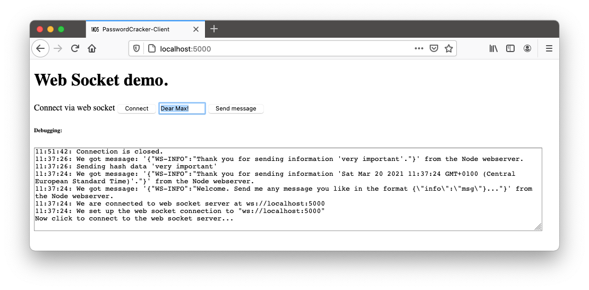

# Real-time Web Apps with web sockets


A minimal implementation to demo real time connection from a server to multiple clients. In TypeScript and node on the serverside. In TypeScript on client side.

### Bild and run the server

First install necessary node modules, compile the TypeScript sources to JavaScript and start the node server (on port 5000) with: 


```
./1_install_and_build.sh
```
(i.e. ```npm install``` and ```tsc```)

```
./2_startup_frontend.sh
```
(i.e. ```node ./server.js```)

Then, connect with any browser to url <http://localhost:5000>.

### Explanations

The node server starts as normal HTTP server and serves one single HTML (and one Javascript) file. 

The (multiple) (web) clients connect to the server using the same port via **protocol upgrade** to web sockets.

Messages are exchanged as JSON objects in the form {"info":"message"}

Every message is distributed to all currently connected clients.




### Development hint 1

The node package and start information can be configured in ```package.json```.

The TypeScript compilation can be customised in the configration file ```tsconfig.json```.

### Development hint 2

You might use the Python tool "wsdump.py" to connect with command line tool to the web socket server.

### Development hint 3

With ```./9_cleanup.sh``` you can get rid of the node modules and the generated JavaScript files. After cleanup, the *.js files must be recreated again with TypeScript compile ```tsc``` (see script ```./1_install_and_build.sh```).


# Test it (on the commandline)

Optionally, use a command line tool [**wsdump.py**](https://websocket-client.readthedocs.io/en/latest/getting_started.html) to test the web socket server

* requirements

	```
	pip3 install websocket-client
	chmod +x wsdump.py
	```
	
* startup


	```
	./wsdump.py ws://localhost:9090 -vv
	```


# Test web client

* open webpage: <http://localhost:5000>


- - -

		
Find this project at: <https://git-iit.fh-joanneum.at/Feine/omd-web-devel>