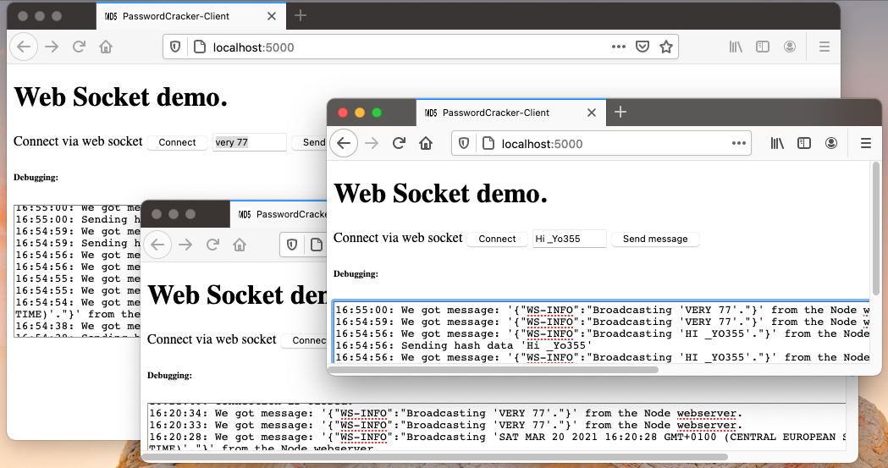

[Home](../README.md)

# Real-time Web

Allow to *live update* content on the client. Server pushes changes to (many) client.

## Alternatives
* Polling
* Notifications
* HTTP/2

## WebSockets

* **Peer-to-peer** connection between two parties. Sending with ```send()``` and listening for incoming data by registering a callback on the ```onMessage```- event. 

* A web socket connection is always **initiated by web client**.

* **Protocol upgrade** (A client sends a normal http request to the server asking for protocol upgrade, which allows to use the same ip and the same port for normal *http://* or *https://* connection and at the same time the *ws://* or *wss://* connection)

Find an example with source code (in TypeScript) in directory [Part-08 MinimalServer/4-javascript-websocket/](../Part-08-MinimalServer/4-javascript-websocket) including a [README](../Part-08-MinimalServer/4-javascript-websocket/README.md).





[Next part (Web Assembly, wasm)](../Part-12-WebAssembly/study-material--wasm.md)