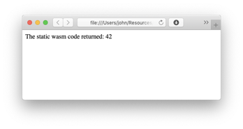
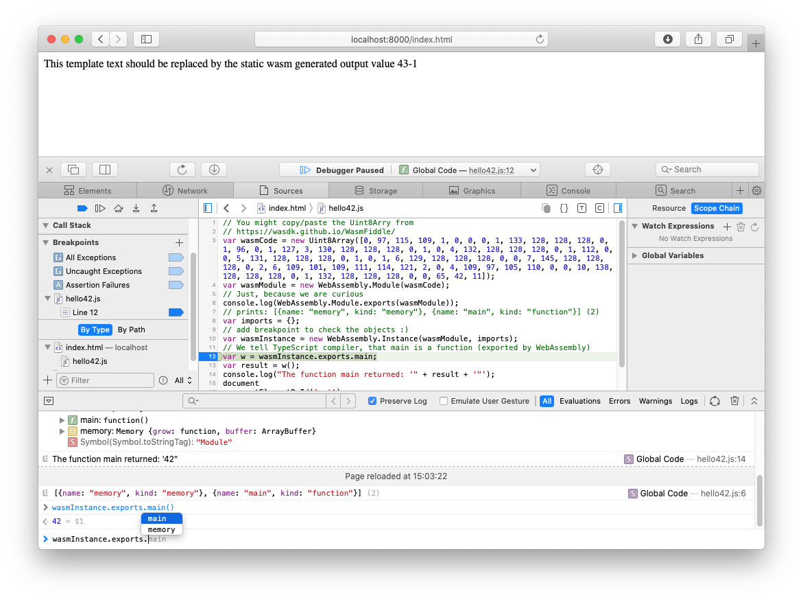

# WASM (Static)
 
### Simple demo running compiled (CodeBuffer) web assembly code


Note: the wasm can be generated online at <https://wasdk.github.io/WasmFiddle/> from 

```
int main() { 
  return 42;
}
```


Now compile and copy code-buffer from <https://wasdk.github.io/WasmFiddle/>

```
[0, 97, 115, 109, 1, 0, 0, 0, 1, 133, 128, 128, 128, 0, 1, 96, 0, 1, 127, 3, 130, 128, 128, 128, 0, 1, 0, 4, 132, 128, 128, 128, 0, 1, 112, 0, 0, 5, 131, 128, 128, 128, 0, 1, 0, 1, 6, 129, 128, 128, 128, 0, 0, 7, 145, 128, 128, 128, 0, 2, 6, 109, 101, 109, 111, 114, 121, 2, 0, 4, 109, 97, 105, 110, 0, 0, 10, 138, 128, 128, 128, 0, 1, 132, 128, 128, 128, 0, 0, 65, 42, 11]
```

Create TypeScript File

```
const wasmCode = new Uint8Array([0,97,115,109,1,0,0,0,1,133,128,128,128,0,1,96,0,1,127,3,130,128,128,128,0,1,0,4,132,128,128,128,0,1,112,0,0,5,131,128,128,128,0,1,0,1,6,129,128,128,128,0,0,7,145,128,128,128,0,2,6,109,101,109,111,114,121,2,0,4,109,97,105,110,0,0,10,138,128,128,128,0,1,132,128,128,128,0,0,65,42,11]);

const wasmModule = new WebAssembly.Module(wasmCode);

// Just, because we are curious
console.log(WebAssembly.Module.exports(wasmModule)) 
// prints: [{name: "memory", kind: "memory"}, {name: "main", kind: "function"}] (2) 

const imports = {}

// add breakpoint to check the objects :)
const wasmInstance = new WebAssembly.Instance(wasmModule, imports );

// We tell TypeScript compiler, that main is a function (exported by WebAssembly)
const w: Function = <Function>wasmInstance.exports.main

const result = w()
console.log( "The function main returned: '" +  result + '"' )

document
  .getElementById('out')
  .innerText = "The static wasm code returned: " + w()
```


Compile TS to JS

```
tsc hello42.ts
```

This will generate some JS ```hello42.js```:

```
var wasmCode = new Uint8Array([0, 97, 115, 109, 1, 0, 0, 0, 1, 133, 128, 128, 128, 0, 1, 96, 0, 1, 127, 3, 130, 128, 128, 128, 0, 1, 0, 4, 132, 128, 128, 128, 0, 1, 112, 0, 0, 5, 131, 128, 128, 128, 0, 1, 0, 1, 6, 129, 128, 128, 128, 0, 0, 7, 145, 128, 128, 128, 0, 2, 6, 109, 101, 109, 111, 114, 121, 2, 0, 4, 109, 97, 105, 110, 0, 0, 10, 138, 128, 128, 128, 0, 1, 132, 128, 128, 128, 0, 0, 65, 42, 11]);
var wasmModule = new WebAssembly.Module(wasmCode);
// Just, because we are curious
console.log(WebAssembly.Module.exports(wasmModule));
// prints: [{name: "memory", kind: "memory"}, {name: "main", kind: "function"}] (2) 
var imports = {};
// add breakpoint to check the objects :)
var wasmInstance = new WebAssembly.Instance(wasmModule, imports);
// We tell TypeScript compiler, that main is a function (exported by WebAssembly)
var w = wasmInstance.exports.main;
var result = w();
console.log("The function main returned: '" + result + '"');
document
    .getElementById('out')
    .innerText = "The static wasm code returned: " + w();
```


* Try it out: 
	* just open ```index.html```, or 
	* run local server ```ruby -run -ehttpd . -p8000``` ... 
	* ...and view at <http://localhost:8000>




