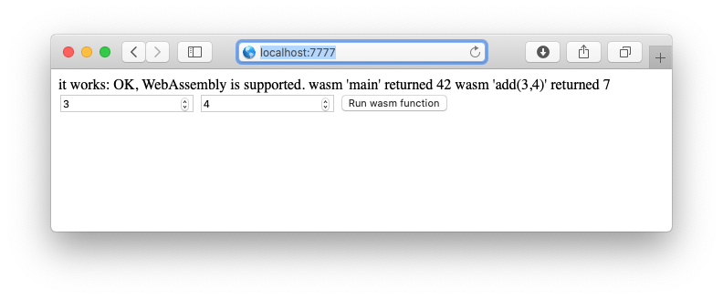
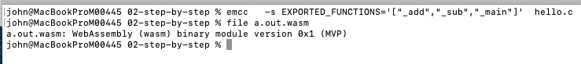
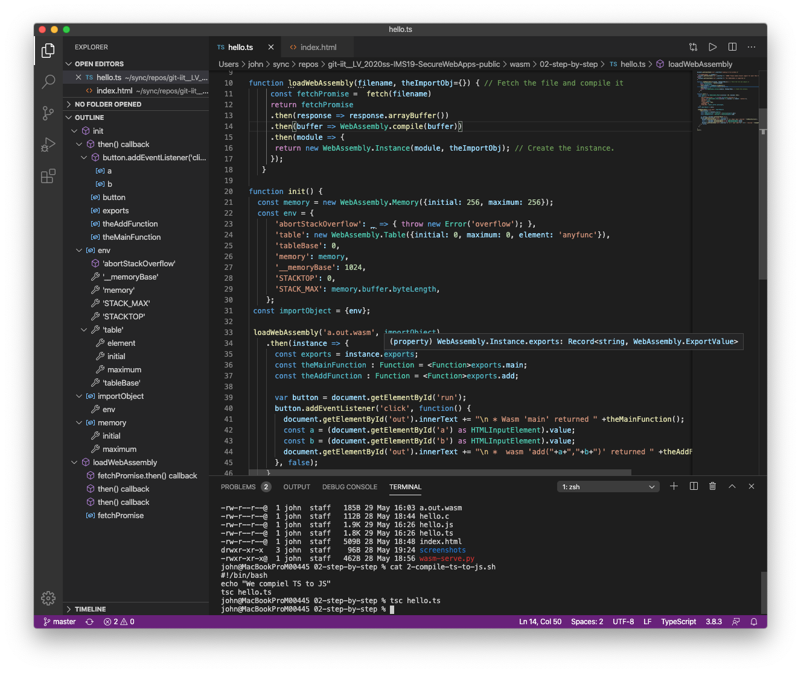

# WASM Step-by-step





* create file ```hello.c```

```
int add(int a, int b) { 
  return a+b;
}

int main() { 
  return 42;
}

int sub(int a, int b) { 
  return a-b;
}
```

* compile (see file ```compile-c-to-wasm.sh```)

```
emcc \
  -s EXPORTED_FUNCTIONS='["_add","_sub","_main"]' \
  -Os \
  -s SIDE_MODULE=1 \
  hello.c
```




*NOTE: If you compiled on remote machine, you might scp the file(s) back to your local machine with ```scp secweb:/root/secwebwasm/step-by-step/a.out.wasm .```*


create ```ìndex.html```

```
<!DOCTYPE html>
<html>
 <head>
  <meta charset="UTF-8">
  <meta name="viewport" content="width=device-width, initial-scale=1">
  <link rel="shortcut icon" href="/favicon.ico" />
  <script src="hello.js" defer></script>
  <title>Hello WASM</title>
 </head>
 <body>
    <div id="out">output will appear here</div>
    
    <input id="a" type="number" value="3" size="3" min="0"/>
    <input id="b" type="number" value="4" size="3"/>
    <button type="button" id="run">Run wasm function</button>
 </body>
</html>
```

* provide TS file ```hello.ts```


```TypeScript

document.getElementById('out').innerText="Loading JS file worked.\n" 

if (!('WebAssembly' in window)) {
  document.getElementById('out').innerText += " ERROR! Please enable browser support for wasm! Then try again.\n";
}else{
  document.getElementById('out').innerText += " OK, WebAssembly is supported.\n"
}

// Fetch the file and compile it
function loadWebAssembly(filename, theImportObj={}) { 
     const fetchPromise =  fetch(filename)
     return fetchPromise
     .then(response => response.arrayBuffer())
     .then(buffer => WebAssembly.compile(buffer))
     .then(module => {        
        // Create the instance.
      return new WebAssembly.Instance(module, theImportObj);
     });
   }

function init() {
  const memory = new WebAssembly.Memory({initial: 256, maximum: 256});
  const env = {
      'abortStackOverflow': _ => { throw new Error('overflow'); },
      'table': new WebAssembly.Table({initial: 0, maximum: 0, element: 'anyfunc'}),
      'tableBase': 0,
      'memory': memory,
      '__memoryBase': 1024,
      'STACKTOP': 0,
      'STACK_MAX': memory.buffer.byteLength,
    };
 const importObject = {env};

 loadWebAssembly('a.out.wasm', importObject)
    .then(instance => {
      const exports = instance.exports;
      const sumIt : Function = <Function>exports.sumThree;
    
      var button = document.getElementById('run');
      button.addEventListener('click', function() {
        document.getElementById('out').innerText += "\n * Wasm:";
        const a = (document.getElementById('a') as HTMLInputElement).value;
        const b = (document.getElementById('b') as HTMLInputElement).value;
        const c = (document.getElementById('c') as HTMLInputElement).value;
        document.getElementById('out').innerText += 
            "\n *  wasm 'sumIt("+a+","+b+","+c+")' returned " +sumIt(a,b,c);
      }, false);
    }
  );

}
init();

```





* compile TS to JS 

Requriremnt: typescript compiler is installed


	```
	tsc hello.ts 
	```


* to file ``hello.js```

* Serve the files (with proper mime type):

```
#!/usr/bin/env python3
import sys
import http.server
from http.server import HTTPServer, BaseHTTPRequestHandler
import socketserver
PORT= int(sys.argv[1])  if len(sys.argv) > 1 else 8000
 
Handler = http.server.SimpleHTTPRequestHandler
Handler.extensions_map['.wasm'] = 'application/wasm'
httpd = socketserver.TCPServer(  ('0.0.0.0', PORT),  Handler )

print("Modified Python3 server for WASM (application/wasm) is serving at port", PORT)
httpd.serve_forever()
```


* Startup server

```
./startup.sh 7777
```

* On command line
	* ```curl http://10.77.23.94:7777/index.html```
	* ```curl http://10.77.23.94:7777/hello.js```
	* ```curl http://10.77.23.94:7777/a.out.wasm --output down.wasm```
	 
* Open in browser <http://localhost:7777>


---


Links:

<https://gist.github.com/kripken/59c67556dc03bb6d57052fedef1e61ab> 