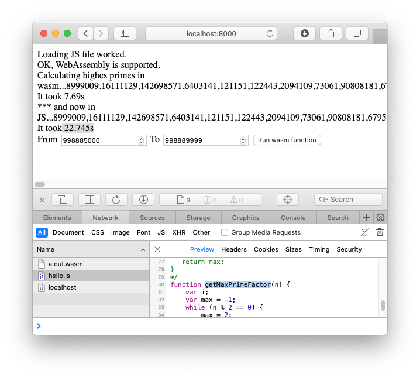

# WASM compare performance

Demo to compare C with wasm speed.

---



C to wasm 

```
#include<math.h>
int getMaxPrimeFactor(int n) {
   int i, max = -1;
   while(n % 2 == 0) {
      max = 2;
      n = n/2; //reduce n by dividing this by 2
   }
   for(i = 3; i <= sqrt(n); i=i+2){ //i will increase by 2, to get only odd numbers
      while(n % i == 0) {
         max = i;
         n = n/i;
      }
   }
   if(n > 2) {
      max = n;
   }
   return max;
}
```

<https://www.tutorialspoint.com/c-program-for-find-largest-prime-factor-of-a-number>


ts

```
function getMaxPrimeFactor (n:number):number {
  var i
  var max = -1;
   while(n % 2 == 0) {
      max = 2;
      n = n/2; //reduce n by dividing this by 2
   }
   for(i = 3; i <= Math.sqrt(n); i=i+2){ //i will increase by 2, to get only odd numbers
      while(n % i == 0) {
         max = i;
         n = n/i;
      }
   }
   if(n > 2) {
      max = n;
   }
   return max;
}

```

Note:

use ```const startJS = performance.now()``` to time some x-thousand calls...


Links:

<https://gist.github.com/kripken/59c67556dc03bb6d57052fedef1e61ab>