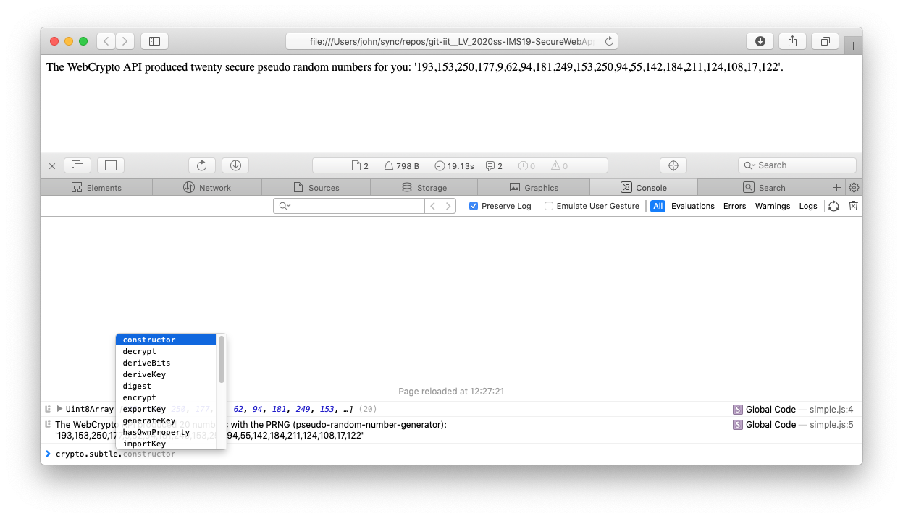

[Home](../../README.md), [Up](../study-material--security.md)


# WebCrypto API

### Simple demo using WebCrpto API

Minimal source code, see file ```01-crypto-api-random/random.ts```:

```
const twentyBytes = crypto.getRandomValues(
		new Uint8Array(20));
console.log(twentyBytes)
// 206,145,66,62,166,148,9,74,128,113,57,126,143,247,70,245,48,177,76,215

// Optional: hex output
Array.prototype.map.call(twentyBytes, x=> ('00' + x.toString(16)).slice(-2)).join('')
// ce91423ea694094a8071397e8ff746f530b14cd7
```


The script ```./01-compile.sh``` creates some TypeScript (and HTML) demo code in dir [01-crypto-api-random](./01-crypto-api-random/):

* [index.html](./01-crypto-api-random/index.html)
* [random.ts](./01-crypto-api-random/random.ts)

*Note: The script starts up a (node) watcher which compiles the TypeScript to JavaScript after changes to the given TypeScript file ```random.ts```. It also starts a Python3 server to serve static files (e.g. ```index.html```) within the subdir ```01-crypto-api-random```.*


# Check out the methods provided by the CryptoAPI

In your webbrowser, inspect in the develoer console the object ```crypto```:




- - - 

Links: 

* API-Documentation <https://developer.mozilla.org/en-US/docs/Web/API/Crypto/getRandomValues>

* <https://developer.ibm.com/articles/secure-javascript-applications-with-web-crypto-api/>


- - - 

This file can be found at <https://git-iit.fh-joanneum.at/Feine/omd-web-devel/-/tree/master/Part-13-Security/CryptoAPI>