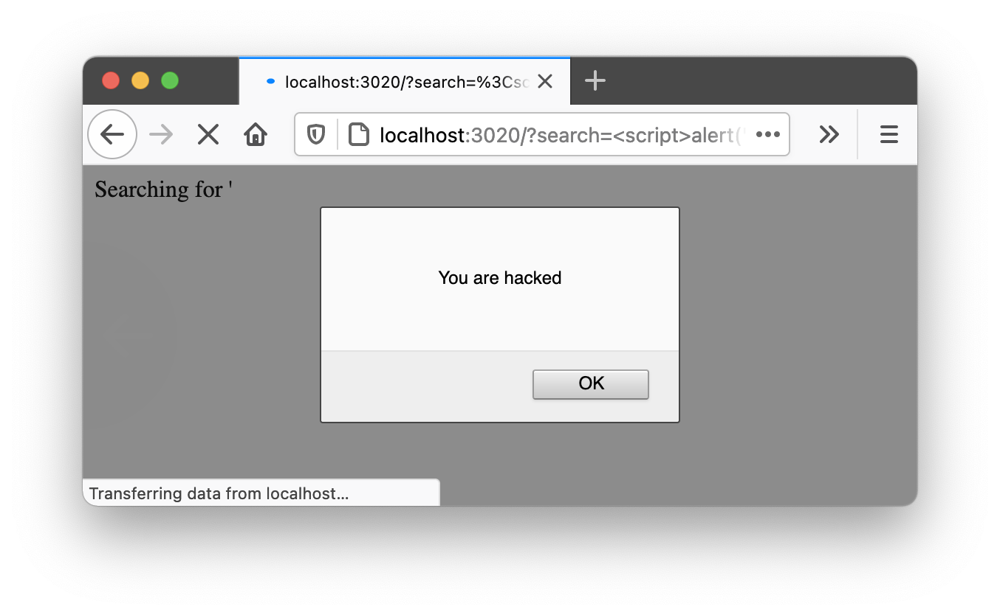

[Home](../../../README.md), [Up](../README.md)

### IN-Secure Web Servers and Web Applications


# XSS — Cross Side Scripting 

A very simple, very broken TypeScript (node) server:


## Startup 

* Startup the broken node (express) server


	```
	startup.sh
	```
	
	
* Try the server
	
	<http://localhost:3020/>

* Try a search on the server	

	<http://localhost:3020/?search=help>
	
## Details

* Hack into the server by sending *unexpected* search - input to with your http request

	```
	?search=whatever
	``` 

	<http://localhost:3020/?search=%3Cu%3EWe%20are%20injecting%20arbitrary%20html%20tags%20(here:%20underline)%3C/u%3E>
	
	<http://localhost:3020/?search=%3Cscript%3Ealert(%27Executing%20arbitrary%20JS%20code%27)%3C/script%3E>

	<http://127.0.0.1:3020/?search=%3Cbr%3E%3Cscript%3Ea=%27js-code-inserted-and-executed%27;alert(a)%3C/script%3E>

*Note:* It's possible to execute JavaScript at the client side, e.g. to modify HTML (or to load remote data). For example, find out ways to display **arbitrary text to the user**. Check out and analyse the few lines of server source code.




*Note:* It is possible not just to echo the payload to the victim using **reflected XSS**, but to persist on server side. This is called **stored XSS**. Find out what might happen if you use an additional query parameter named ```store```? 


* e.g.: 
	* first <http://127.0.0.1:3020/?search=inserted&store=1>
	* and <http://127.0.0.1:3020/?search=look-my-session-id-is-987&store=1>

	* then <http://127.0.0.1:3020/?search=hello>

	* optionally, insert a permanent script with curl 

	
		```bash
		curl 'http://127.0.0.1:3020/?search=<br><script>a="Hi-Again-from-Curl";alert(a);</script>&store=1'
		```


Use multiple browsers <http://localhost:3020/?search=whatever&store=true>.

 

- - -
		
Find this project at: <https://git-iit.fh-joanneum.at/Feine/omd-web-devel/-/tree/master/Part-13-Security/InsecureServers/13-Server-XSS-CrossSideScripting>