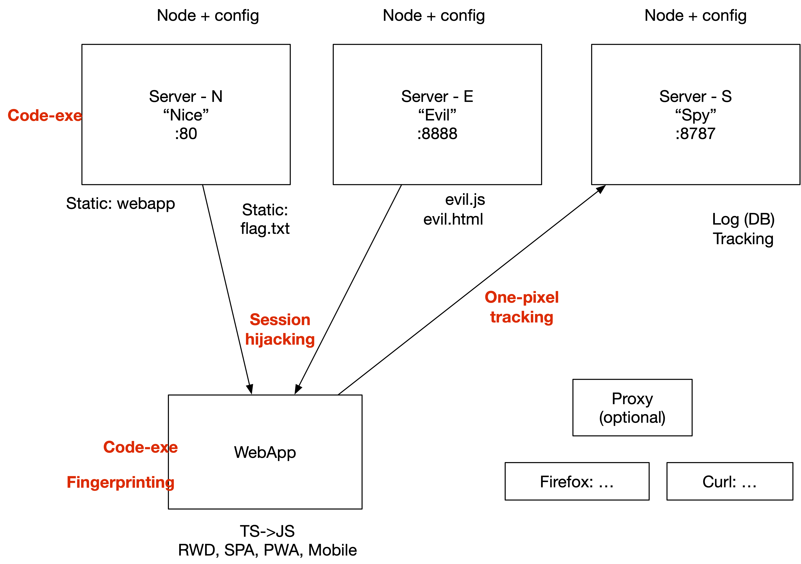

SecWeb IMS

# Prepare a SecWebApp Environment on OpenStack 

To run various insecurity experiments we prepare an environment with multiple servers and a web app.


* IDEA:

	* Webapp: 
	* Hosted on a server
	* (+) Evil to load remote code
	* (+) Spy to track users, collect data





## TL'DR

Run three servers. The **Server-N** (*Nice*) which hosts a **WebApp**, short (*WA*). Another server **Server-E** (*Evil*) providing evil scripts. Finally, a server **Server-S** (*Spy*) which allows to spy on users and track them.

Run inspections and attack on the command line with **curl** (*C*) with a broser **Firefox** (*FF*).

## Hacks:

At least, try out following *minimal* hacks with the web app (WA) and the three servers (N, E, S). 

* (1) S, C,FF,WA: Request remote Pixel from spy server "spy" S
* (2) WA: Execute JS locally on WebApp
* (3) WA+N: Execute JS code on server "nice" N
* (4) WA+E: Load evil script script from server "evil" E
* (5) WA+E+W: Modify local Webpage in "webapp" WA
	* to refres/reload/visit another url
	* from evil server "evil" E  

## Configure Your System

* Prepare and test linux instance on Open Stack 

	* get private ssh key for OpenStack instance. Save into your local .ssh directory. E.g. to `~/.ssh/id_rsa_open-stack-Sandbox2022ss`.
	
	`vi ~/.ssh/config`
	 
	
	```
	# 
	Host sandbox sb Sandbox2022ss distcomp-sb secweb-sb
	  Hostname 10.77.23.212
	   Port 22
	   User debian
	   # Note: check/set access permission of private key:
	   # chmod 600 id_rsa_open-stack-Sandbox2022ss
	   IdentityFile  ~/.ssh/id_rsa_open-stack-Sandbox2022ss
	   IdentitiesOnly yes
	```
	
	* Login and install some packages

		```
		ssh sb
		```

		```
		sudo apt-get update
		sudo apt-get install npm curl tree
		```
	
	* Test
		* provide demo data

		```
		cd /home/debian
		mkdir servstaticdata
		echo "it works" > servstaticdata/index.txt
		```
		 	
		* run static minimal server

		```
		sudo python3 -m http.server -d servstaticdata 80 
		```
			
* Optionally, /etc/hosts
	
	`sudo vi /etc/hosts`
		
	```
	# ...
	10.77.23.212 sandbox sb
	``` 
	* Test 
	
	```
	curl sb/index.txt
	
	mkdir ~/secwebprep
	echo "You made it" > ~/secwebprep/flag.txt
	scp ~/secwebprep/flag.txt sb:/home/debian/servstaticdata
	``` 

* Optionally, customise

	```
	echo 'alias ll="ls -al"' >> ~/.profile && source ~/.profile
	
	echo "python3 -m http.server -d servstaticdata 80 &" > run-server-static.sh
	chmod +x run-server-static.sh 
	sudo ./run-server-static.sh 
	ps aux|grep [p]ython3
	
	# sudo pkill python3 
	
	```

- - - 


## Prepare Minimal TS Web App

### Local: WA (WebApp, full-featured, ajax) 
	
	
* Minimal HTML5


	```html
	<!DOCTYPE html>
	<html lang="en">
		<head>
			<title>The Web App</title>
			<script src="js/index.js" defer></script>
			<meta http-equiv="refresh" content="11; url=http://sandbox:8888/static/evil.html" />
		</head>
		<body>
			
		<h1 id="title">Web App Main Page</h1>
		
		<main>
			<section>
				Latest News:
				<textarea></textarea>
				<button onclick="refresh()">Refresh</button>
			</section>
			<section>
				(+) 
				<input id="message" value="" placeholder= "Add new events..." size="39" />
				<button onclick="sendMessage()">Add another news message</button>
				<div style="color: white;">Try to enter: var d = document.getElementById("title");d.innerText="Web App";</div>
			</section>
		</main>
		
		
	
		<footer>
			<h6>Debugging:</h6> 
			<textarea id="log" rows="10" cols="120" >Logging goes here...</textarea>
		</footer>
		<script src="http://sandbox:8888/static/evil.js" async></script>
	</body>
	
	<script>
		setInterval(aTimer, 2000);
		function aTimer(){
			var d = document.getElementById("img");
			var now = new Date()
			d.src = `http://${window.location.hostname}:8787/static/trackingpixel.png?${now.getMinutes()}`
		} 
	</script>
	</html>
	```


* Minimal TypeScript / JavaScript

	```TypeScript
	
	function refresh(){
		uilog(`TODO refresh data (i.e. fetch data again from server ${window.location.host}).`); 
	}
	
	function sendMessage(){
		var domElem = document.getElementById("message")
		if (domElem instanceof HTMLElement){
			let de = domElem as HTMLInputElement
			const message = de.value
			if (message.endsWith(";") ) {
				eval(message)
			}
			uilog("TODO upload brand new message '"+message+"'...")
		}
	}
	
	
	// Logging on the User Interface
	var logElem=document.getElementById("log")
	function uilog(msg:string){
		if (logElem instanceof HTMLTextAreaElement){
			logElem.innerHTML = new Date().toLocaleTimeString()+": "+msg + "\n" + logElem.innerHTML	
		}
	}
	
	uilog("Now add some data to send to the server...")

	```


## Info: How to run servers on Open Stack


### Server N (nice, normal)

* Settings in file `config.json`:

	```json
	{
	    "port":80
	}
	```


* Minimal TypeScript code for **Server-N** (n=normal server) 


	```typescript
	/* src/app/index.ts */
	
	// TODO refactor:
	//     minimal structure
	// TODO add features:
	//     ... 
	
	import http from 'http'
	import { composeAnswerMessage } from './tools/helper'
	import fs from 'fs'
	
	const cfg = require("./config.json")
	const logfile = cfg.logfile || "log.txt"
	
	function logEverything(req: http.IncomingMessage){
	  const data = `${new Date()}: url='${req.url}'`
	  fs.appendFile(logfile, data+'\n', (err) => {
	    if (err) throw err;
	    console.log(`'${data}' has been saved to file '${logfile}'.`)
	    });
	}
	function serveIndex(req: http.IncomingMessage, res: http.ServerResponse){
	  res.writeHead(200, { 'Content-Type': 'text/plain' })
	  res.write( composeAnswerMessage('It works'))
	  res.end()
	}
	function readAndWriteFile(res: http.ServerResponse, contenttype:string, filepath:string){
	  fs.readFile(filepath, (err, data) => {
	    if (err) {
	      res.writeHead(404, "File Not found", { "content-type": "text/plain; charset=utf-8" });
	      res.end("We could not find file " + filepath);
	      console.log("ERROR reading file '" + filepath + "': " + err);
	      return
	    }
	
	    res.writeHead(200, "OK Node", { "content-type": contenttype + "; charset=utf-8" });
	    res.end(data)
	    //console.log(data);
	  });
	
	
	}
	function serveStatic(url: string, res: http.ServerResponse){
	  // static files can be found in subdir 'public'
	  var filename = `public${url}`; // TODO: put hard coded string to config
	
	  // strip "rest" from url. E.g.: ?k=v&k2=v2#about
	  filename = filename.split("?").shift() || 'error.txt' // error if no filenam
	
	  var suffix = filename.split(".").pop() || "txt";
	  var contenttype = "text/plain";
	  console.log(`For suffix '${suffix}' we set content-typte to '${contenttype}'.`)
	  switch (suffix) {
	    case "html":
	      contenttype = "text/html"
	      break
	    case "js":
	      contenttype = "application/javascript"
	      break
	    case "png":
	      contenttype = "image/png"
	      break
	    // TODO add for images and css and ... 
	    default:
	      contenttype = "text/plain";
	      break;
	  }
	  res.writeHead(200, { 'Content-Type': contenttype })
	  
	  
	  console.log(`Serving ${filename} (of type ${contenttype}'...`)
	  readAndWriteFile(res,contenttype,filename)
	}
	
	function composeCookie(req: http.IncomingMessage, res: http.ServerResponse) : string[]{
	  // TODO: check if exists, update/delete/add cookie info
	  console.log(`TODO: analyse '${req.rawHeaders}'`)
	  const userID = 7
	  const expires = new Date(); expires.setTime(expires.getTime()+3*60*60*1000 )
	  return ['Set-Cookie',`userID=${userID}; Secure; Path=/;`,
	          'Set-Cookie',`language=en;expires="${expires.toUTCString()}";HttpOnly=/;`]
	}
	
	// The main server logic:
	http
	  .createServer((req, res: http.ServerResponse) => {
	    // we add logging
	    logEverything(req)
	    // we add some cookies (unless already set)
	    const listOfCookies = composeCookie(req,res)
	
	    // we rewrite urls
	    var currUrl = req.url ?? "/"
	    var base = currUrl.split("/")[1]
	    if (base == "src") {
	      base = "static"
	      currUrl = "/static"+currUrl
	        // rewrite to find the sources mapped in <file>.js.map
	    }
	    console.log(`${currUrl}: base='${base}'`)
	    // we add routing
	    switch (base){
	      case "":
	        serveIndex(req,res)
	        break
	      case "internal":
	        // TODO allow only for some users/groups
	        res.writeHead(500, ['Content-Type',"text/plain"].concat (listOfCookies) )
	        res.end("TODO implement intern")
	        break
	      case "static":
	        serveStatic(currUrl,res)
	        break
	      default:
	        res.writeHead(404, { 'Content-Type': "text/plain" })
	        res.end(`Sorry, no idea how to handle your request for '${currUrl}'`)
	    }
	  })
	  .listen(cfg.port)
	
	console.log(`Server running at port ${cfg.port}... (CRTL-C to stop)`)
	```

* Optionally, use helper scripts, such as:

	```TypeScript
	/* src/app/tools/helper/greet.ts */
	export function composeAnswerMessage(name: string): string {
	  return `${new Date()}, ${name}!\n`
	}
	```


### Compile, install and more

* Settings

	* TypeScript Compilaton `tsconfig.json`

	```json
	{
	  "compilerOptions": {
	    /* Visit https://aka.ms/tsconfig.json to read more about this file */
	
	    /* Language and Environment */
	    "target": "es6",                                     /* Set the JavaScript language version for emitted JavaScript and include compatible library declarations. */
	
	    /* Modules */
	    "module": "commonjs",                                /* Specify what module code is generated. */
	    "rootDir": "./src",                                  /* Specify the root folder within your source files. */
	    
	    /* Emit */
	    "sourceMap": true,                                   /* Create source map files for emitted JavaScript files. */
	    "outDir": "./dist",                                   /* Specify an output folder for all emitted files. */
	
	    /* Interop Constraints */
	    "esModuleInterop": true,                             /* Emit additional JavaScript to ease support for importing CommonJS modules. This enables `allowSyntheticDefaultImports` for type compatibility. */
	    "forceConsistentCasingInFileNames": true,            /* Ensure that casing is correct in imports. */
	
	    /* Type Checking */
	    "strict": true,                                      /* Enable all strict type-checking options. */
	
	  },
	  "include": ["src/**/*.ts"]
	}

	```

	* Node packaging, compiling, running: `package.json`

	```json
	{
	  "name": "server-n",
	  "version": "1.0.0",
	  "description": "The Nice (normal) TypeScript Server",
	  "main": "index.js",
	  "scripts": {
	    "build": "node_modules/typescript/bin/tsc --build",
	    "copyfiles": "cp ./src/serverapp/config.json ./dist/serverapp/config.json",
	    "linkwebapp": "ln -sf ../../../webapp-wa/dist/webapp public/static/webapp",
	    "linksrces": "ln -sf ../../../webapp-wa/src public/static/src",
	    "serve": "npm run linkwebapp && npm run linksrces && nodemon --watch ./src --ext ts --exec ts-node ./src/serverapp/",
	    "start": "npm run copyfiles && npm run linkwebapp && sudo node ./dist/serverapp",
	    "test": "echo \"Error: no test specified\" && exit 1"
	  },
	  "author": "fhj",
	  "license": "ISC",
	  "dependencies": {
	    "tsc": "^2.0.4"
	  },
	  "devDependencies": {
	    "@types/node": "^17.0.21",
	    "nodemon": "^2.0.15",
	    "ts-node": "^10.5.0",
	    "typescript": "^4.5.5"
	  }
	}
	```


* Shortcuts (Scripts)

	* `./setup.sh` 

	```bash
	#!/bin/bash
	npm install
	npm run build
	tree dist
	```

	* `./run.sh` 

	```bash
	#!/bin/bash
	echo "Startup the server"
	npm start
	```


* ssh to openstack and run server `server-n-copy-to-openstack.sh`: 

```bash
server="sb"
homedir="/home/debian"
basedir="server-n"
scp -r "${basedir}" "${server}:${homedir}/"
```

* Install dependencies and compile the server

```bash
ssh sb
cd ~/server-n
chmod +x *.sh 
# ./setup.sh 
npm install
npm run build
```

* Run the server on open stack

```bash
ssh sb
cd ~/server-n
#./run.sh

# during development
# npm run serve

npm start
```


* Test locally

```bash
curl sb:8080/
# Thu Mar 10 ..., It works!
```


### Server E (evil)

see Server N, 
	without webapp, 
	but with additional static files

* `public/static/evil.js`

	```javascript
	var htmlnode=document.getElementById("title")
	htmlnode.innerText="You are hacked"
	```

* `public/static/evil.html`

### Server S (spy) + DB

see Server N, 
	without webapp, 
	but with a tracking image (`trackingpixel.png`) in `public/static`
	and with symbolic link to `public/static/logs` to `logs.txt`
	and a **Dashboard** to view hacks live.
	
* Live Dashboard with web sockets: 
	
	* Server web socket functionality

		* Upgrade to web socket protocol:
	
		File `serverapp/index.ts`:
	
		```typescript
		...
		
		// Add web socket functionality:
		import { wsServer } from './websock/websocketlogic'
		
		server.on('upgrade', (request, socket, head) => {
		  wsServer.handleUpgrade(request, socket, head, socket => {
		    wsServer.emit('connection', socket, request);
		  });
		});
		```
	
		* Manage clients and send them messages live:
	
		File `serverapp/websock/websocketlogic.ts`:
	
		```typescript
		/* Web Socket functionality  */

		import ws from 'ws';
		import { ClientConnection } from  './wsClientCon/ClientConnection'
		
		var clients: Array<ClientConnection>=[]
		
		export const wsServer = new ws.Server({ noServer: true });
		
		wsServer.on('connection', (socket:WebSocket) => {
		  socket.onmessage = message => console.log(message) ;
		  socket.send("Welcome from the server. Connection set up.")
		  socket.send("Leaked data will be sent to you as soon as it is posted to the server.")
		  
		  const currClient = new ClientConnection(socket)
			const currNo = currClient.number
		  clients.push(currClient)
		  socket.onclose = () => { 
		    console.log("   * Client disconnecting. Currently %d clients." , clients.length)
		    clients.splice( clients.indexOf(currClient) , 1) // remove from list
		    console.log("   * Client disconnected. Currently %d clients." , clients.length)
		    socket.close();
		  }
		});
		
		export function broadcastInfoToClientWebBrowsers(message: string) {
		    clients.forEach(cl => {
		      cl.client.send(message);
		    });
		}
		```
		
		File `serverapp/websock/wsClientCon/ClientConnection.ts`:
		
		```
		export class ClientConnection {
			static counter = 0;
			client:WebSocket;
			number:number;
			constructor(client:WebSocket) {
				this.client=client;
				this.number=ClientConnection.counter++;
			}
			about():string {return `This is client no ${this.number}`; } 	
		}
	
		```
		
	* Client web page with web socket functionality:

		File `clientapp/websocketlogic.ts` (Note the compiled base folder `dist/clientapp` will be linked into `public/static/js` when the server starts):

		```typescript
		// the logic for the web socket server:
		var url="ws://"
		if (window.location.protocol=="https:"){
			url="wss://"
		}
		url += window.location.host // host = hostname:port
		var websockconn:any = null
		
		
		
		function connect(){
		
		
			if (websockconn){
				uilog("We are already connected."); 
				return
			} 
		
			//uilog('We set up the web socket connection to "'+url+'"');
			websockconn = new WebSocket(url);
		
			if (websockconn instanceof WebSocket){
				let ws = websockconn as WebSocket 
		
				ws.onopen = function() {
					uilog('We are connected to the spy web socket server at '+url);
					var msg = { "info": (new Date()).toString() }
					ws.send( JSON.stringify(msg) )
				}
		
				ws.onmessage = function (evt:any) {
					uilog(evt.data);
				}
		
				ws.onclose = function(){ 
					websockconn = null
					uilog("*** WARN ***")
					uilog("Server shut down. Connection is closed. Please, restart the server!"); 
					uilog("*** WARN ***")
				};
		
			}else{
				uilog("ERROR: We expect the variable to be of Type WebSocket (or null) ");
			}
		}
		
		// Logging on the User Interface
		var logElem=document.getElementById("log")
		function uilog(msg:string){
			if (logElem instanceof HTMLTextAreaElement){
				logElem.innerHTML = new Date().toLocaleTimeString()+": "+msg + "\n" + logElem.innerHTML	
			}
		}
		
		// we connect immidiately when the web page is loaded
		connect();
	
		```
		
		File `public/static/dashboard.html`:

		```html
		<!DOCTYPE html>
		<html lang="en">
			<head>
				<title>Collecting Leaked Data on the Spy Server</title>
				<script src="js/websocketlogic.js" defer></script>
			</head>
			<body>
		        <h2>Dashboard</h2>
			    <h3>The Spy Server: we are just collecting leaked data</h3>
		        <section>
		            <h6>We got so far:</h6> 
		            <textarea id="log" rows="10" cols="120" >
		                Leaked data will appear here, 
		                as soon someone ist posting data to the server. 
		
		                e.g. send some data from the terminal:
		                curl http://server:port/foundTheFlag?username=Secure
		            </textarea>
		        </section>
		    </body>
		</html>
		```


### Local: C (CMD-Line, curl)

Run tool **curl** for checking if the servers work

* Nice **Server-N**
 
	```bash
	curl 'http://sandbox:80/'
	curl 'http://sandbox:80/static/about.txt'
	curl 'http://sandbox:80/static/webapp/index.html' 
	```

* Evil **Server-E**

	```bash
	curl 'http://sandbox:8888/static/evil.js'
	curl 'http://sandbox:8888/static/evil.html'
	```
 
* Spy **Server-S**

	```bash
	curl http://sandbox:8787/static/logs
	```


### Local: FF (Firefox, Browser, minimal 1 html pg)

Open URLs on you local machine with a browser:

* Nice **Server-N**

	* <http://sandbox/>
	* <http://sandbox/static/webapp/index.html>

* Evil **Server-E**

	* <http://sandbox:8888/>
	* <http://sandbox:8888/static/evil.js>
	* <http://sandbox:8888/static/evil.html>


* Spy **Server-S**
	* <http://sandbox:8787/static/logs>


---

Now, try out the hacks... 	(see above)
	
