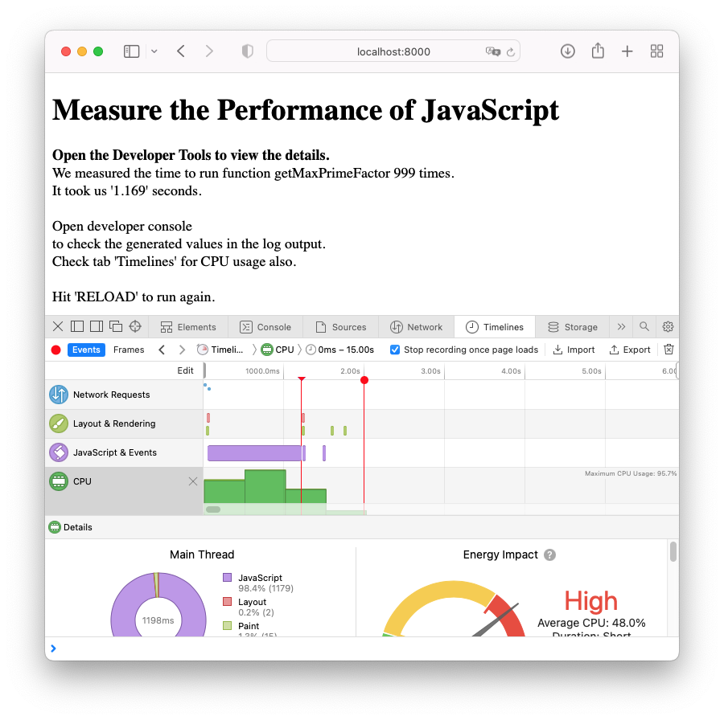

[Home](../../README.md), [Up](../study-material--optimisation.md)


# Performance Metering



```
performance.mark('start');
// ... perform some expensive operations ... 
performance.mark('stop');

const m = performance.measure(
	"ManyTimesMaxPrimeFactor", 
	'start', 
	'stop');

console.log('Time used: ' + m.duration / 1000 + 's')
```


### Live Demo

Change into directory [PerformanceMetering](./PerformanceMetering) and install dependencies with `setup.sh`. Then run the web app on a static server with `run.sh`.

```
cd PerformanceMetering
./setup.sh &
./run.sh
```


- - - 

This file can be found at <https://git-iit.fh-joanneum.at/omd/web-devel/-/tree/master/Part-14-Optimisation/PerformanceMetering>