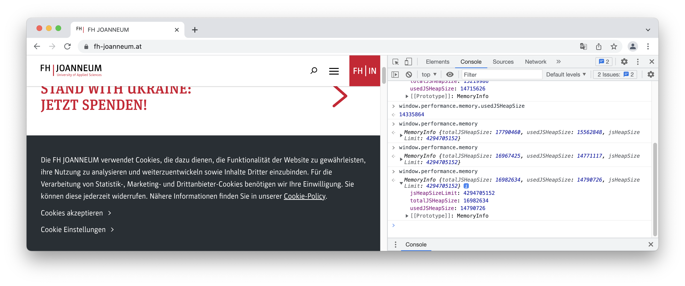

[Home](../README.md)

# Selected Topics / Optimisation 

Before optimising logic, measure the current performance and find out where the bottle necks really are. 


## Inspect Memory Usage


```JavaScript
window.performance.memory
```




## Measure Performance

Create named timestamps and get time used in milliseconds.

```
performance.mark('start');
// do something for a longer time... 
performance.mark('stop');
var used = performance.measure(
	"We measured a long lasting action", 
	'start', 
	'stop');
console.log('time used: ' + used.duration + 'ms');

```


## Protocol Buffers

Performant data transfer. Check out [Demo in subdir ProtocolBuffers](./ProtocolBuffers) 

* better than current alternatives:
	* plain text, cvs, html
	* XML
	* JSON
* fast
* compact
* language **and** platform agnostic
	* serialisation
	* transmission

### How to

* Step 1: Design **message structure**

	* Request: `HashRequest`
		* With parameter: `md5hash` (The type should be a  `string`) 	
	* Response: `PasswordReply`
		* With parameter: `password` (The type should be a  `string`) 
	
	* for a **service**: `MD5HashCracking`
		* method:  `CrackTheMD5Hash`
	
* Step 2: Define protocol buffer message types: ```*.proto``` files

	For example, [`cracking.proto`](./ProtocolBuffers/cracking.proto):

	```
	syntax = "proto3";
	...
	service MD5HashCracking {
	  rpc CrackTheMD5Hash (HashRequest) returns (PasswordReply) {}
	}
	
	message HashRequest {
	  string md5hash = 1;
	}
	
	message PasswordReply {
	  string password = 1;
	}
	```

* Step 3: Compile to Ruby/PythonC#/JS/... stubs
	
	```bash
	protoc ...
	``` 
	
	For example, to generate node/JavaScript in directory `gen` for `cracking.proto`:
	
	```
	mkdir -p gen
	
	./node_modules/grpc-tools/bin/protoc.js \
	  --js_out=import_style=commonjs,binary:./gen/ \
	  --grpc_out=grpc_js:./gen cracking.proto
	```
	
	


* Step 4: Understand (serialisation and deserialisation) how to use messages in your code

	For example, in JavaScript:
	
	```javascript
	toObject()
	serializeBinary()
	deserializeBinary()
	```

	For example, in Python:
	
	```Python
	toObject()
	SerializeToString()
	ParseFromString()
	```
	
	Compare the usage of the methods `serializeBinary` and `deserializeBinary ` ( in the generated files [cracking\_grpc\_pb.js](./ProtocolBuffers/gen/cracking_grpc\_pb.js) and [cracking_pb.js](./ProtocolBuffers/gen/cracking_pb.js). Note, this requires that you run the compilation before (see [`2-install-and-compile.sh`](./ProtocolBuffers/2-install-and-compile.sh)). 
		
	
	* toObject():
	
	```JavaScript
	proto.cracking.HashRequest.prototype.toObject = function(opt_includeInstance) {
  		return proto.cracking.HashRequest.toObject(opt_includeInstance, this);
	};
	```
	
	* cracking_pb.HashRequest.deserializeBinary(...)
	
	```JavaScript
	function deserialize_cracking_HashRequest(buffer_arg) {
	  return cracking_pb.HashRequest.deserializeBinary(new Uint8Array(buffer_arg));
	}
	```
	
	
	
* Step 5: Transfer messages (hiere: Client / Server setting): 
	
	* 5a) Server provides functionality 

		For example, a service/server/worker could provide the **Service**, the functionality:
		
		```
		function crack(call, callback) { 
			h = call.request.getMd5hash()
			repl = new messages.PasswordReply()
			reply.setPassword(`The cracked hash ${h} is for password ...')
			callback(null, reply)
		}
		
		var server = new grpc.Server();
		server.addService(services.MD5HashCrackingService, {
		      crackTheMD5Hash: crack
		});
		
		server.bindAsync(
			'0.0.0.0:50051', 
			grpc.ServerCredentials.createInsecure(), 
			() => {
		    	server.start();
		    }
		);
		```


	* 5b: Client requests via gRPC protcol buffers:


		For example, a **client** can use the service/server/worker:
		
		For testing, we calculate demo md5 hash with: `md5 -s verySecure` and get `MD5 ("verySecure") = 3acab568ca3c13728919f1c711e22afd`
	
		```
		var serverWithPort = 'localhost:50051';
		
		var client = new services.MD5HashCrackingClient(
		                serverWithPort,
		                grpc.credentials.createInsecure());
		
		var request = new messages.HashRequest();
		request.setMd5hash('3acab568ca3c13728919f1c711e22afd');
		
		client.crackTheMD5Hash(request, function(err, response) {
		    console.log('The password is:', response.getPassword());
		});
		```


[Back to Overview](../Overview/study-material--overview.md)